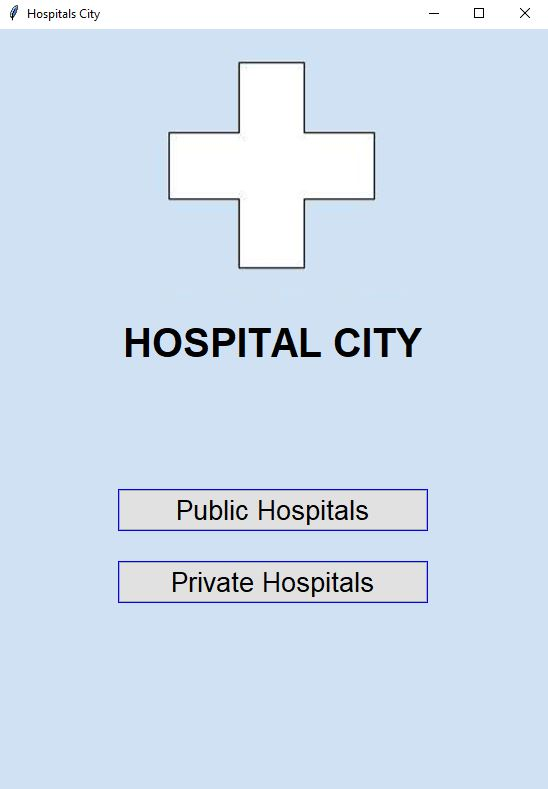
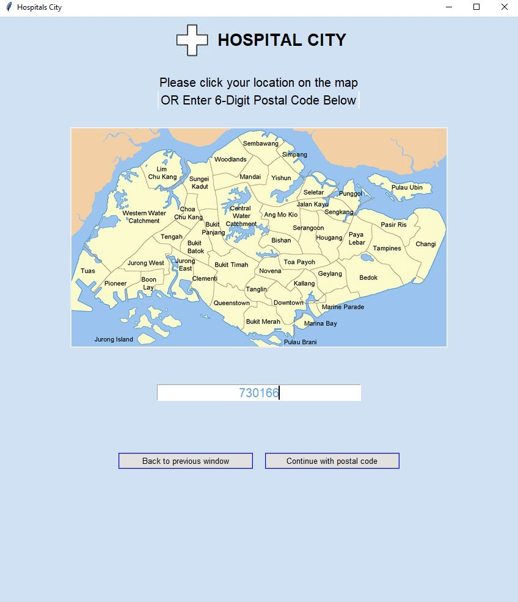
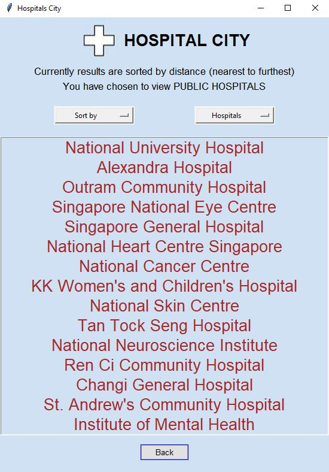

# Find Hospitals Near Me
With a total of 32 hospitals around the island, this desktop application finds the nearest hospital from your current location via postal code or manually marking your location on the map

### Tech Stack
* [Tkinter] - Python de-facto standard GUI (Graphical User Interface) package
* [JSON] - configure details of hospitals with no code changes; easy for humans to read and write

## Demos
### 1. Main Menu

### 2. Enter your Postal Code or Indicate on the map your location

### 3. Based on the postal code, a list of hospitals are displayed, sorted according to distance

### 4. Finally, a description of the hospital of your choice

